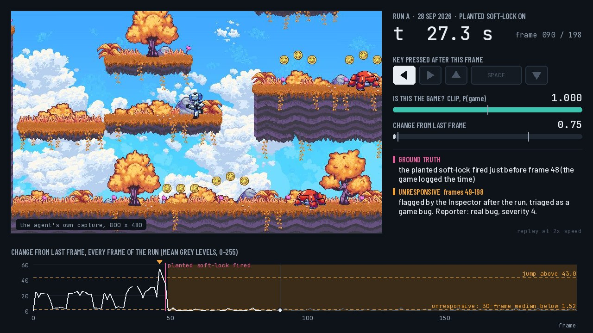

# godot-bug-finder

A small three-agent game tester (Explorer, Inspector, Reporter) that plays a
Godot platformer, flags suspicious moments and writes bug reports.

**Replays of real runs, with every number: https://data-professional-taiyabkhan.github.io/godot-bug-finder/**

[](https://data-professional-taiyabkhan.github.io/godot-bug-finder/)

I started it in May 2026 as a prototype for my application to a University of
Surrey PhD studentship co-supervised with Sony Interactive Entertainment:
[QoE-Driven Agentic AI for Automated Bug Discovery in Video Games](https://www.jobs.ac.uk/job/DRA154/phd-studentship-qoe-driven-agentic-ai-for-automated-bug-discovery-in-video-games-collaborative-doctorate-with-sony-interactive-entertainment)
(PGR-2526-075). It is my own work for that application, not affiliated with
Surrey or Sony.

The git history has three chapters:

- **May 2026**: the original skeleton, committed unchanged.
- **27 September**: a local CLIP model so the agents can tell the game from
  everything else, thresholds measured on a clean run, and a planted bug the
  system can actually catch.
- **28 September**: a code clean-up with identical detection behaviour, the
  Reporter running through OpenRouter, a window-focus check in the guard, a
  pop-up test for it, and the replay page in `docs/`.

It is a small prototype, not a research system, and this README records the
misses as well as the catches.

## How it works

| Part | File | What it does |
|------|------|--------------|
| **Explorer**  | `explorer.py`  | Plays with a seeded mix of random keys and short committed runs left or right (key presses via `pyautogui`, screenshots via `mss`). |
| **Guard**     | `explorer.py`, `perception.py` | Before each key press it checks the game window has focus, and every fifth tick it asks CLIP whether the frame is the game. If a check fails it presses nothing, brings the game back and checks again: observe, decide, act, recover. After three failed tries it ends the run. |
| **Inspector** | `inspector.py` | Runs after the run. Flags **sudden jumps** (frame-to-frame change above a threshold) and **unresponsive** stretches (the 30-frame median change stays below a threshold while at least half the keys pressed are moves). CLIP marks frames that are not the game as a **harness** problem and keeps them out of the pixel signals. Writes an evidence folder per anomaly and `signals.csv` with every frame's numbers. |
| **Reporter**  | `reporter.py`  | Sends four frames per anomaly (the first from just before it) and the Inspector's summary to a vision LLM, and asks for a JSON report: title, severity 1-5, reproduction steps, suspected cause, `is_real_bug`. OpenRouter by default (Claude Sonnet 5); Anthropic and OpenAI are wired in but untested. |
| Perception    | `perception.py`| CLIP ViT-B/32 (Hugging Face `transformers`), zero-shot, on the CPU: 82 and 141 ms per frame in two measurements on an i5-11300H laptop. |

`run_demo.py` launches Godot, runs all three, and scores the run against the
planted bug's ground truth. `calibrate.py` sets thresholds from a clean run.
`eval_perception.py` measures the CLIP check against labelled frames.
`guard_test.py` opens a window over the game mid-run to test the guard.

**Pace.** `EXPLORER_FPS` is 10, but pyautogui sleeps 0.1 s after every key
event, so every logged run has recorded 3.24-3.36 frames a second. A 30-frame
window is therefore about 9 s, and the guard's CLIP check comes about every
1.5 s. Earlier versions of this README said 10 fps and "3 s"; that was wrong.
The thresholds were calibrated at the real pace, so I have left it alone.

## What happened when I ran it

### May 2026 (the original)

- Four runs. The Inspector flagged two anomalies, and **both were harness
  errors, not game bugs**: the game window dropped out and the screen capture
  recorded my IDE instead. One "sudden jump" into the IDE, one "freeze" on it.
  Meanwhile the Explorer kept sending key presses to whatever window had focus.
- The Reporter never ran, and the planted ledge bug was added after the last
  run, so it was never tested.
- The capture box was 32 px too low: every frame of the "fixed" run ended in a
  32 px black band.

### 27 September

| Check | Result |
|-------|--------|
| CLIP "is this the game?" on 416 labelled frames from the May runs (328 game, 88 IDE or black) | **416/416 correct, zero-shot.** Lowest P(game) on a real game frame: 0.97. Highest on a non-game frame: 0.02. Prompts fixed before the run. |
| The May 09:24 run, inspected again | The two "game bugs" become **one harness issue**: frames 110-194 are not the game. |
| Thresholds from the clean May run | Sudden jump: change > 43.03 (was 60). Unresponsive: 30-frame median change < 1.52 while moving (the first version was "every frame < 0.76"). |
| Live runs 1 and 2 | Guard on, every captured frame was the game, and the capture box fix removed the black band. Bug 2 never fired: its code lived in `level.gd`, which is not attached to any scene. (I first blamed the Explorer for not reaching the trigger zone. That was wrong.) |
| Live run 3 (bug 2 moved to `planted_bugs.gd`, 30 s timer) | Fired at frame 55. **The Inspector missed it.** A paused game keeps animating shader grass (changes of 0.07-1.98 after the pause), so "every frame below 0.76" never held for 30 frames. I rewrote the rule as a 30-frame median. |
| Live run 4 (a fresh run, new rule fixed beforehand) | Fired at frame 55. **Caught:** one `unresponsive` anomaly, frames 56-195. CLIP saw the game in 196/196 frames, so it was triaged as a game bug. No other anomalies. |

### 28 September

Offline, after the clean-up:

| Check | Result |
|-------|--------|
| CLIP on the same 416 frames | 416/416 again, same extremes (141 ms per frame this time). |
| All 8 earlier runs inspected again | Identical anomalies and identical per-frame numbers in `signals.csv` to the code before the clean-up. |
| `calibrate.py` on the clean May run | Same thresholds: 43.03 and 1.52. |
| Godot headless, soft-lock after 0.5 s | Fired and wrote its ground-truth event; with `GBF_SOFTLOCK=0` it stays off. |
| Reporter on the May 09:24 run | "Test harness lost focus: IDE window captured instead of game": not a real bug, severity 1. Right. |
| Reporter on live run 4 | "Character stuck against wall, unresponsive to movement inputs for 140 frames": real bug, severity 4. Right about the bug, wrong about the cause: it guessed a wall, and the real cause is a timer that pauses the game. |

Live, with the cleaned code (examples in `examples/`, replays on the page above):

| Run | Result |
|-----|--------|
| **Run A**, soft-lock on, 60 s | Fired just before frame 48. **Caught:** `unresponsive`, frames 49-198, median change 0.91 against 22.9 in clean play, every frame judged the game (lowest P(game) 0.99). **One false alarm:** a `sudden_jump` at frames 46-47 (changes 54.4 and 44.2), where a jump moved the camera. The Reporter called the soft-lock a real bug, severity 4 ("frozen game-state bug"), and the jump not a real bug ("normal gameplay movement and camera scrolling"). |
| **Run B**, soft-lock off, 60 s | 198 frames, **zero anomalies**, lowest P(game) 0.98. |
| Run C, first try | A setup error: the pop-up opened and closed while Godot and CLIP were still loading, before the first frame. `guard_test.py` now waits for the run's first frame. |
| **Run C**, pop-up over the game, 45 s | The pop-up opened 10.1 s in. Frame 34 was recorded with it half over the game, and CLIP gave that frame 0.53, just over the 0.5 cut-off. The next guard check (tick 35) got 0.37: no key pressed, game window raised, and **play resumed 0.8 s later on the first attempt**. But frame 34 counted as game, so the Inspector flagged a `sudden_jump` triaged as a game bug instead of a harness problem, and the Reporter dismissed it for the wrong reason (it blamed the camera; frame 34 was not among the four it was sent). The pop-up never took keyboard focus, so the focus check did not fire: only the CLIP half of the guard has been tested live. The pop-up also landed off-centre because of 150% display scaling; `guard_test.py` now asks Windows for real pixel coordinates. |

Also fixed on 28 September: `run_demo.py`'s scorer credited any game-triaged
anomaly near the event, which in run A was the false-alarm jump. It now needs
the expected kind (`unresponsive` for the soft-lock) and lists everything else
as not explained by a planted bug.

Across every run so far, the lowest 30-frame median change in normal play was
4.1; after the soft-lock it sat between 0.59 and 1.00. That gap is what the
unresponsive rule relies on, and it comes from under ten minutes of play.

## Planted bugs (ground truth)

| Bug | Where | What happens | Can this system see it? |
|-----|-------|--------------|--------------------------|
| 1. Phantom ledge (May) | `demo_project/level/level.tscn`, node `ShortcutLedge` | The collision box sits 32 px right of the sprite, so the left 32 px are a strip you fall through. | **No.** Falling through a ledge looks like ordinary falling, both to pixel differences and to a whole-frame CLIP check. It needs perception that knows what a platform is, or access to game state. |
| 2. Timed soft-lock (September) | `demo_project/planted_bugs.gd`, node `PlantedBugs` in `game_singleplayer.tscn` | 30 s after start the game pauses itself without the pause menu: still rendering, nothing responds. | **Yes**, as an `unresponsive` anomaly that CLIP confirms is still the game. Caught in runs 4 and A, missed in run 3 by the first rule. |

Bug 2 is a fault injection on a timer: it tests inspection and triage, not
exploration. Two earlier versions fired only when the player stood in a zone
near the spawn point. Both lived in `level.gd`, which (as in the upstream
Godot demo) is not attached to any scene, so neither ever ran.

## Quickstart (Windows)

```bat
python -m venv .venv
.venv\Scripts\pip install -r requirements.txt

rem Godot 4.6.2 (editor build) goes in tools\godot\ ; it is not in the repo.
rem First CLIP use downloads about 600 MB of weights into .hf_cache\
rem For the Reporter, put OPENROUTER_API_KEY=... in a .env file (git ignores it).

.venv\Scripts\python calibrate.py <a clean session>
.venv\Scripts\python run_demo.py 60            &rem hands off: it presses real keys
.venv\Scripts\python run_demo.py 60 --clean    &rem same, with bug 2 switched off

rem Guard test: start both together
start .venv\Scripts\python guard_test.py 10 8
.venv\Scripts\python run_demo.py 45 --clean

.venv\Scripts\python reporter.py <session>     &rem reports for an inspected run
```

Raw sessions (frames and logs) are not in the repo because of their size;
`examples/` holds small samples, and `eval_perception.json` and
`thresholds.json` hold the measured numbers.

## Honest limitations

1. **Exploration is random + heuristic, not learned.** It is seeded, so each
   run replays the same key sequence, and in 60 s it mostly wanders near the
   spawn point. No curiosity-driven RL, no coverage reward, no VLM-guided moves.
2. **Anomaly signals are pixel maths plus a whole-frame CLIP check.** Neither
   understands gameplay, which is why bug 1 is invisible. A real detector
   would be a learned, QoE-aware model of what matters to a player.
3. **Thresholds come from one clean minute of play.** The unresponsive rule
   was rewritten after it missed bug 2 once, then caught it on two fresh runs.
   The jump threshold fired on a camera move in run A. Two catches are a
   demonstration, not a detection rate.
4. **Other windows can get into the evidence.** The CLIP check runs every
   fifth tick and cuts at 0.5, so a half-covered frame was recorded as game in
   run C. Capturing the game window itself, rather than a region of the
   screen, would remove the problem.
5. **The CLIP check was evaluated on 416 frames from one game and one IDE.**
   It is a sanity check, not a benchmark.
6. **The Reporter's causes and repro steps are unverified guesses.** It has
   judged real bug or not correctly in all five reports so far, but twice gave
   the wrong reason. Severity is its zero-shot guess, with no QoE training data.
7. **No reproduction step.** The Inspector reports single observations; it
   does not replay the inputs to confirm a failure.
8. **External probing only, Windows only.** No engine instrumentation;
   `pyautogui`, `pygetwindow` and fixed window positions tie it to one setup.

## Files

```
godot-bug-finder/
├── config.py           # every setting: paths, capture box, thresholds, prompts, LLM backend
├── perception.py       # CLIP: "is this the game?"
├── utils.py            # screen capture, key presses, window focus, session log
├── explorer.py         # Explorer and its guard
├── inspector.py        # Inspector: pixel signals + CLIP triage, evidence
├── reporter.py         # Reporter: vision-LLM bug reports
├── calibrate.py        # thresholds from a clean run -> thresholds.json
├── eval_perception.py  # CLIP accuracy on labelled frames -> eval_perception.json
├── run_demo.py         # launch Godot, run everything, score against bug 2
├── guard_test.py       # a pop-up over the game mid-run, to test the guard
├── main.py             # the three agents without launching Godot
├── docs/               # the replay page (GitHub Pages) and its videos
├── examples/           # small samples of real outputs, reports included
└── demo_project/       # Godot's 2D platformer demo + the two planted bugs
```

## Credits

The game is Godot's official 2D Platformer demo from
[godot-demo-projects](https://github.com/godotengine/godot-demo-projects)
(MIT licence, see `demo_project/LICENSE.md`), with two planted bugs added.
Music: "Pompy" by Hubert Lamontagne (madbr), as credited in the demo's README.
